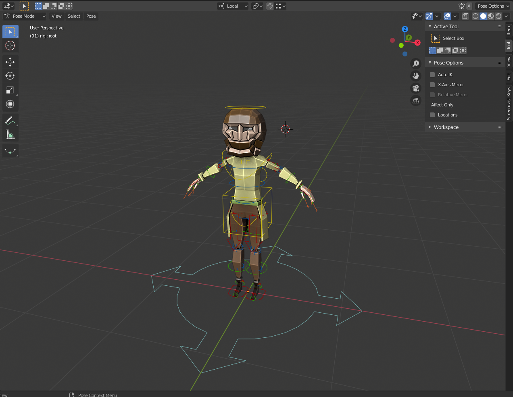
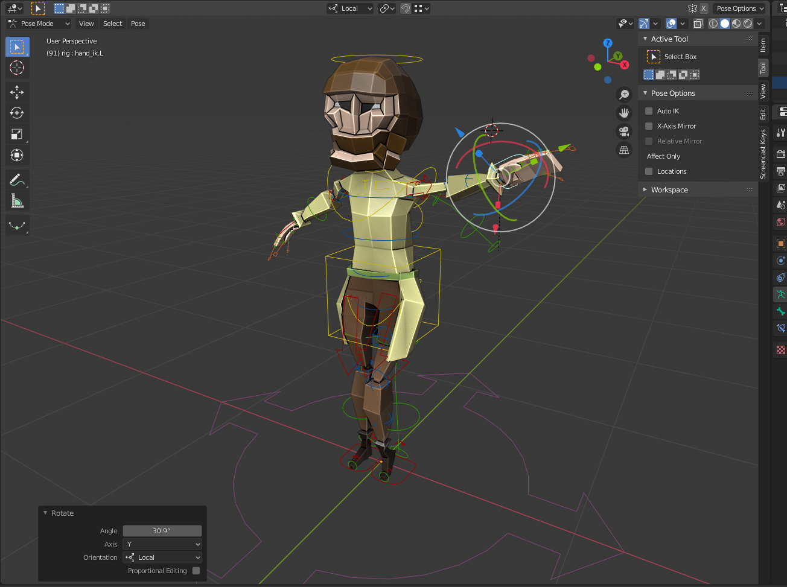
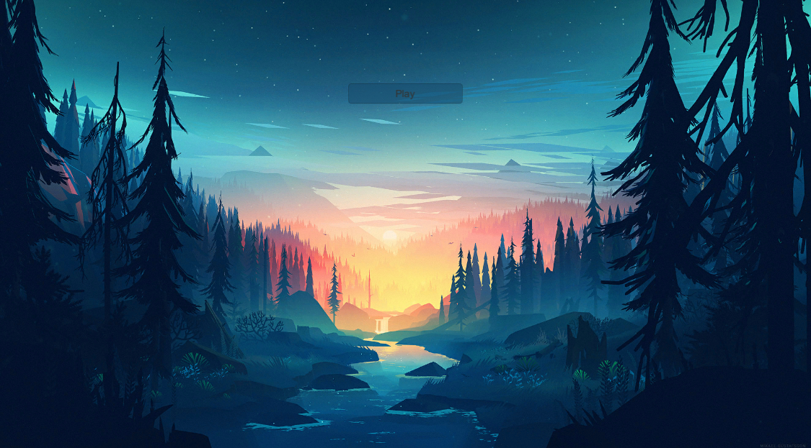
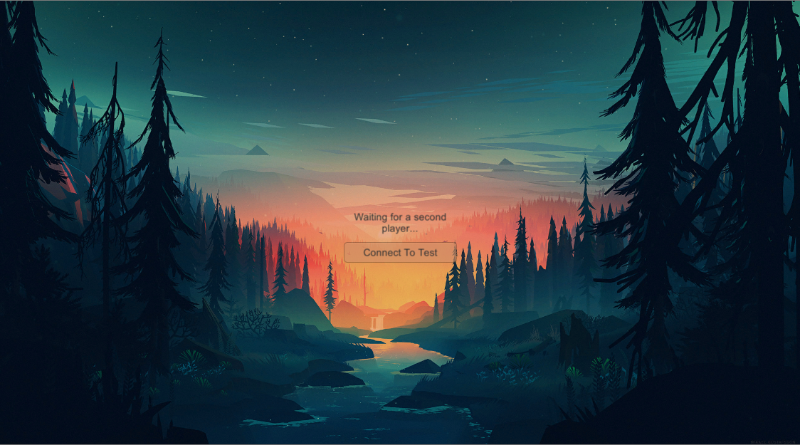
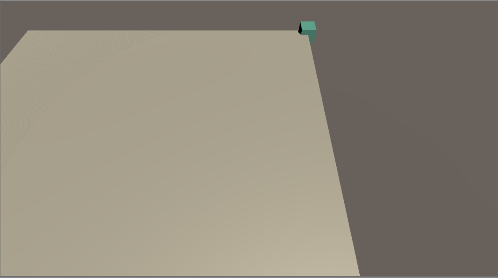

# Kalandria
Kalandria is a passion project somewhere between a MOBA like DOTA 2 and a fast paced RTS such as Starcraft.
### Creating my own art
I love using blender and wanted to get faster at making models. 
Not only did I want to get faster, but I wanted more experience rigging my own creations. 
I saw someone make a model in ten minutes and got inspired. 

While this model took me more than ten minutes to create...
I was happy with the final result of the model, and I had managed to rig it.
Ultimately, I will be recreating this asset... but I figured I would showcase it a little.

### Main menu
At the moment the main menu is very simplistic. 
It has some temp art made by Mikael Gustafsson. 
As for features it currently has a play button which connects the user 
to the network using Photon Engine's pun. 
It then proceeds to load the next room, which is a simple lobby 

### Lobby
Currently the lobby is just a waiting room for a second player to connect 
Once the second player is in, the next room will be loaded. 
However for testing purposes I created a dev button which can be pressed to load it immediately 

### Test Room
This is the very barest of bones for a test room 
It simple has the beginnings of each players base, 
as well as the player themself who is able to pan around the scene in classic rts style. 
The panning itself is highly modifiable, even allowing the player to change the margins at which the camera pans. 

